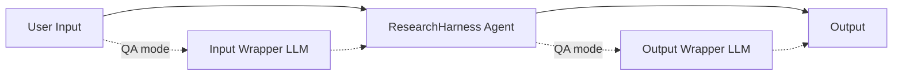
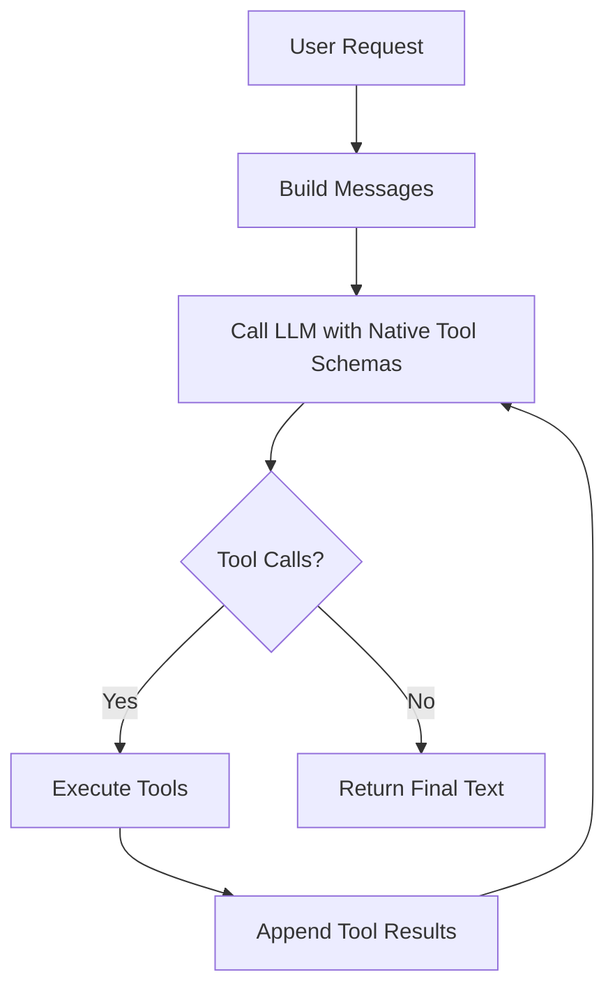
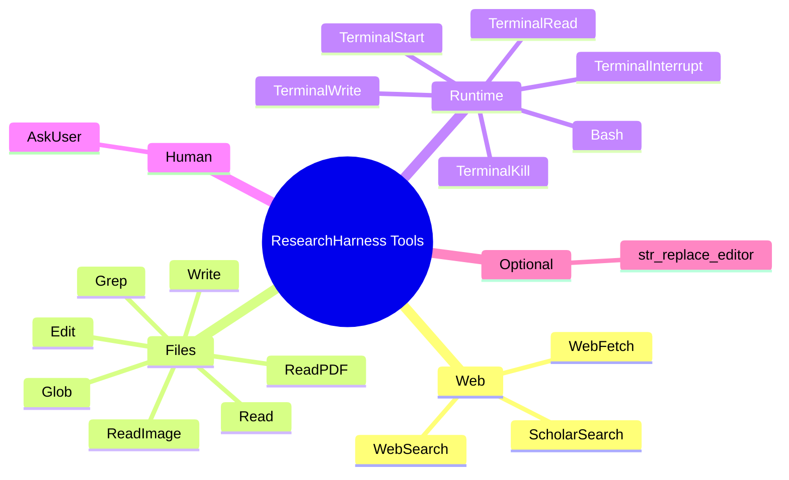

<div align="center">

# 🔬 ResearchHarness

**A lightweight, general-purpose harness for tool-using LLM agents.**

[](LICENSE)
[](https://www.python.org/)
[](#-highlights)
[](https://github.com/InternScience/MarkScientist)
[](#-how-it-works)
[](#execution-records-and-long-runs)
[](https://github.com/InternScience/ResearchClawBench)
[](https://huggingface.co/spaces/InternScience/ResearchHarness)

</div>

ResearchHarness is a foundational harness for running tool-using LLM agents on
real local and web tasks. It is designed to be **general**, **stable**,
**fair**, **lightweight**, and **feature-complete**.

It serves three practical roles:

1. a **fair execution substrate for agent benchmarks** such as [ResearchClawBench](https://github.com/InternScience/ResearchClawBench)
2. a **reference baseline and meta harness** for future harness optimization
3. a **lightweight personal assistant runtime** for coding, file work, and report writing

The goal is not novelty for its own sake. The goal is to provide a small,
inspectable agent harness that is easy to run, easy to compare, easy to extend,
and easy to trust as infrastructure.

📚 **Tutorials:** [English](docs/tutorial_en.md) | [中文](docs/tutorial_zh.md)

🚀 **Try it online now:** [ResearchHarness Online Chat](https://huggingface.co/spaces/InternScience/ResearchHarness)

📮 **Contact:** [xu_wanghan@sjtu.edu.cn](https://black-yt.github.io/)

## 🎞️ Demo

* **Task**: `Help me research the latest work in auto research and create a visually appealing HTML document to introduce this work. Create an index.html file.`

https://github.com/user-attachments/assets/2a5de733-732d-4fa8-8815-ae42d4a780ef

---

## 📚 Table of Contents

- [📖 Tutorials and Beginner Path](#-tutorials-and-beginner-path)
- [📰 News](#-news)
- [✨ Highlights](#-highlights)
- [🧭 Positioning](#-positioning)
- [🏗 Project Structure](#-project-structure)
- [📦 Installation and Configuration](#-installation-and-configuration)
- [🖥 CLI Usage](#-cli-usage)
- [🐍 Python API Usage](#-python-api-usage)
- [🎛 Local Frontend UI](#-local-frontend-ui)
- [🚀 OpenAI-Compatible API Deployment](#-openai-compatible-api-deployment)
- [🧠 How It Works](#-how-it-works)
- [🛠 Tool Surface](#-tool-surface)
- [🧪 Testing](#-testing)
- [⚠️ Boundaries and License](#️-boundaries-and-license)

---

## 📖 Tutorials and Beginner Path

Detailed tutorials are available in both English and Chinese:

- [English tutorial](docs/tutorial_en.md)
- [中文教程](docs/tutorial_zh.md)

They cover installation, environment variables, command-line usage, the
OpenAI-compatible API server, text and multimodal requests, wrapper switches,
workspace layout, API request/response contracts, testing, and troubleshooting.

If you are new to the project, the recommended reading order is:

1. Read the tutorial in your preferred language.
2. Skim [News](#-news), [Highlights](#-highlights), and [Positioning](#-positioning) to understand what the harness is and what changed recently.
3. Skim [Project Structure](#-project-structure) so you know where the runtime, tools, API server, tests, and benchmark adapters live.
4. Complete [Installation and Configuration](#-installation-and-configuration).
5. Run either [CLI Usage](#-cli-usage) or [OpenAI-Compatible API Deployment](#-openai-compatible-api-deployment).
6. Read [How It Works](#-how-it-works) only after you need the runtime loop, trace, compaction, or PDF/image details.

---

## 📰 News

🚩 **Update** (2026-05-22) Added a real API smoke test that runs the five SGI benchmark README server commands and OpenAI SDK examples, then validates each expected final-answer format.

🚩 **Update** (2026-05-22) CLI and API deployments can now expose an explicit complete tool set with repeatable `--tool NAME`, useful when a run needs a smaller or benchmark-specific tool surface.

🚩 **Update** (2026-05-21) ResearchHarness is packaged for one-command installation with `pip install researchharness`. The existing source-tree commands remain compatible, and releases can publish to PyPI automatically from GitHub Releases.

🚩 **Update** (2026-05-21) The Python import API now exposes the same core runtime controls as CLI mode: default workspace, role prompt strings/files, image inputs, explicit tool sets, optional extra tools, and decorated custom function tools.

🚩 **Update** (2026-05-20) Tool calls now use single-request semantics, and the ReAct runtime can execute adjacent read-only tool calls concurrently. For example, `Read, Read, Edit, Read` runs as `[Read + Read]`, then `[Edit]`, then `[Read]`, preserving mutation boundaries while improving retrieval throughput.

🚩 **Update** (2026-05-19) `WebFetch` now exposes a single-string `url` schema for broader provider compatibility, including Gemini tool declarations. Fetch multiple pages with multiple `WebFetch` calls.

🚩 **Update** (2026-05-14) ResearchHarness now supports optional extra tools that are not loaded into the default tool set. The first one is `str_replace_editor`, a text editing compatibility tool enabled explicitly with `--extra-tool str_replace_editor`.

🚩 **Update** (2026-05-14) `WebFetch` no longer performs a hidden LLM summarization pass. It now uses a URL-only interface plus optional `start_line`, `end_line`, and `max_chars` controls, returning cleaned, range-bounded webpage text for direct agent inspection.

🚩 **Update** (2026-05-14) `/v1/chat/completions` now dispatches synchronous agent runs through a configurable thread pool instead of blocking the FastAPI event loop. Use `--max-concurrent-runs` to raise throughput when local resources and backend API quota allow it.

🚩 **Update** (2026-05-14) API wrappers are now opt-in by default. The default deployment runs as a transparent ResearchHarness agent service, while QA/VQA benchmark deployments can still use `benchmarks/QA/role_prompt.md --input-wrapper --output-wrapper` when strict answer formatting is useful.

🚩 **Update** (2026-05-14) The OpenAI-compatible API now accepts `model="RH"` for the default backend model and `model="RH--<llm-model-name>"` for a request-local override. The local frontend and hosted Space also expose a per-run model dropdown.

🚩 **Update** (2026-05-14) API requests can pass `extra_body={"workspace-root": "/abs/path/to/existing/workspace"}` to run inside a prepared workspace while still writing per-request traces under `--api-runs-dir`.

<details>
<summary>👉 More News (Click to expand)</summary>

🚩 **Update** (2026-05-13) The local browser frontend and hosted Space now render common LaTeX math delimiters in final assistant Markdown answers, including `$$...$$`, `\(...\)`, and `\[...\]`, while leaving tool outputs and runtime logs unchanged.

🚩 **Update** (2026-05-13) ResearchHarness now includes a one-command local chat UI for interactive agent runs. It streams assistant/tool steps in real time, runs directly inside a selected local workspace, supports image attachments, handles `AskUser` replies through the same chat input box, and lets users continue after a final answer without losing prior context.

🚩 **Update** (2026-05-12) ResearchHarness can now be deployed as a synchronous `/v1/chat/completions` service. Existing OpenAI SDK clients can send plain-text or multimodal requests, while the server creates an isolated workspace per request and can optionally use input/output LLM wrappers for strict benchmark-style answer formatting.

🚩 **Update** (2026-04-30) ResearchHarness now includes an `AskUser` native tool for essential human clarification in interactive runs, while the ResearchClawBench adapter explicitly excludes it to keep benchmark runs non-interactive.

🚩 **Update** (2026-04-30) Explicit `workspace_root` paths are now created at run startup when missing, while tool path resolution still stays bounded inside the workspace.

🚩 **Update** (2026-04-25) ResearchHarness now supports built-in context compaction for long multi-step tasks instead of relying only on a growing raw message list.

🚩 **Update** (2026-04-25) The default compaction trigger is `128k`, and you can override it with `COMPACT_TRIGGER_TOKENS=16k` or `create_agent(compact_trigger_tokens="32k")`.

🚩 **Update** (2026-04-25) The existing `trace_*.jsonl` format now records full `llm_call` and `compaction` payloads in the same file, so reasoning context, tool environment, and memory-compression steps can all be reused for training or distillation.

🚩 **Update** (2026-04-25) Compaction outputs are still written into session state, and the trace now captures the compaction request/response path as an explicit training event.

</details>

---

## ✨ Highlights

- **Native tool calling**
  The harness uses OpenAI-compatible native tool calling instead of a custom text protocol.
- **OpenAI-compatible API serving**
  ResearchHarness can be deployed behind `/v1/chat/completions`, so existing OpenAI SDK clients can call it as a tool-using agent backend.
- **General model support**
  The runtime is built around OpenAI-compatible chat-completions APIs, which makes it straightforward to use GPT, Gemini, Qwen, GLM, and other model families when exposed through that interface.
- **Fair benchmark substrate**
  The project is well-suited to benchmark evaluation because the runtime contract stays explicit, stable, and lightweight.
- **Baseline and meta harness**
  ResearchHarness can act as a reference baseline today and as the harness-under-test when you later optimize prompts, loop policies, tool behavior, or benchmark adapters.
- **Lightweight but complete**
  One main loop, a focused tool surface, readable CLI output, and flat traces cover real agent work without turning the repository into a large platform.
- **Extensible agent base**
  Upper-layer frameworks can subclass the base ReAct agent and append role-specific prompt blocks without rewriting the execution loop.
- **Workspace-first execution**
  Local paths, shell execution, and file discovery all start from one explicit workspace root.
- **Full tool surface**
  File discovery, file reads, PDF reads, image inspection, shell execution, and persistent terminal sessions are all available in one compact runtime.
- **End-to-end evaluation**
  The repo validates actual multi-step agent behavior, not just isolated tool calls.
- **PDF-to-figure workflow**
  `ReadPDF` can expose extracted image paths, and `ReadImage` can inspect the actual extracted figure file.

---

## 🧭 Positioning

ResearchHarness should be understood as a **base harness**: a small execution
substrate for tool-using LLM agents, not a large workflow platform.

| Area | What ResearchHarness focuses on |
| --- | --- |
| Positioning | Foundational harness, not a workflow platform |
| Models | GPT, Gemini, Qwen, GLM, and other OpenAI-compatible LLMs |
| Runtime | Small native tool-calling harness loop |
| Evaluation | Repeatable and benchmark-friendly execution |
| Extensibility | Base agent plus role-specific prompt addenda |
| Personal use | Coding, file processing, report writing, and local agent work |
| Data | Flat JSONL traces for debugging, replay, and optional training reuse |

It is a good fit when you need:

- a common and fair runtime for benchmark evaluation
- a compact baseline for harness research and optimization
- a lightweight personal agent for day-to-day work
- a readable execution loop with real tools and real artifacts
- a stable interface that is easy to debug and compare

It is intentionally **not** trying to be:

- a large workflow engine
- a multi-tenant serving platform
- a deeply abstract orchestration framework
- a kitchen-sink agent product

Instead, it keeps the core contract small and concrete:

- one main ReAct loop
- one explicit workspace root
- one readable CLI entrypoint
- one flat trace format
- one focused but capable tool surface

If you need stricter security isolation or product-specific orchestration, those
should be added as separate layers around the harness rather than folded into
the core runtime.

| Use | Why ResearchHarness fits |
| --- | --- |
| Fair benchmark base | It keeps the runtime contract explicit and lightweight, which is useful for benchmarks such as ResearchClawBench. |
| Baseline and meta harness | It is small enough to inspect and modify, making it a practical reference baseline and an object of optimization itself. |
| Personal assistant | It already includes file, shell, PDF, image, and report-oriented workflows, so it is useful outside benchmark settings too. |

---

## 🏗 Project Structure

Start here if you are reading the codebase for the first time.

### Core runtime

- [run_agent.py](run_agent.py): thin command-line entrypoint for direct agent runs
- [run_frontend.py](run_frontend.py): one-command launcher for the local browser UI
- [run_server.py](run_server.py): OpenAI-compatible API server entrypoint
- [api/openai_server.py](api/openai_server.py): `/v1/chat/completions` request handling, wrappers, and per-request run directories
- [frontend/](frontend): local WebSocket UI, static assets, and browser AskUser bridge
- [agent_base/react_agent.py](agent_base/react_agent.py): main ReAct loop, model calls, tool-call handling, trace/session state integration
- [agent_base/base.py](agent_base/base.py): base agent hooks for extension and benchmark adapters
- [agent_base/prompt.py](agent_base/prompt.py): base system prompt composition
- [agent_base/trace_utils.py](agent_base/trace_utils.py): flat JSONL trace writer
- [agent_base/console_utils.py](agent_base/console_utils.py): readable CLI event printing

### Tools

- [agent_base/tools/tool_file.py](agent_base/tools/tool_file.py): file, PDF, and image tools
- [agent_base/tools/custom.py](agent_base/tools/custom.py): Python function tools for embedded usage
- [agent_base/tools/tool_runtime.py](agent_base/tools/tool_runtime.py): Bash and persistent terminal tools
- [agent_base/tools/tool_web.py](agent_base/tools/tool_web.py): web search, scholar search, and webpage fetching
- [agent_base/tools/README.md](agent_base/tools/README.md): detailed tool documentation

### Benchmark and API Adapters

- [benchmarks/README.md](benchmarks/README.md): benchmark adapter overview
- [benchmarks/](benchmarks): benchmark-specific role prompts and adapters
- [benchmarks/QA/README.md](benchmarks/QA/README.md): QA/VQA OpenAI-compatible API usage

### Docs and Tests

- [docs/tutorial_en.md](docs/tutorial_en.md): detailed English tutorial
- [docs/tutorial_zh.md](docs/tutorial_zh.md): detailed Chinese tutorial
- [tests/](tests): tool checks and end-to-end agent tests
- [tests/example_files/](tests/example_files): fixed local fixtures

### Runtime Roots

- [workspace/](workspace): default local CLI workspace root
- [api_runs/](api_runs): default API deployment run root
- [traces/](traces): default CLI trace output root

Only the `.gitkeep` files in these runtime roots are tracked. Generated files
inside them are ignored.

---

## 📦 Installation and Configuration

### Install

Use any Python environment manager you prefer:

- `venv`
- `conda`
- `uv`
- system Python

Install from PyPI:

```bash
conda create -n rh-env python=3.11
conda activate rh-env
pip install researchharness
```

Or install from source for development:

```bash
conda create -n rh-env python=3.11
conda activate rh-env
git clone https://github.com/InternScience/ResearchHarness.git
cd ResearchHarness
pip install -r requirements.txt
pip install -e . --no-deps
```

The source-tree commands used throughout this README remain available:
`python3 run_agent.py`, `python3 run_server.py`, and `python3 run_frontend.py`.
The package also installs equivalent console entry points:

```bash
rh-agent
rh-server
rh-frontend
```

### Configure

Create a `.env` file in the directory where you run ResearchHarness and fill in all required variables.
If you are using a source checkout, you can start from `.env.example`.

ResearchHarness currently talks to OpenAI-compatible chat-completions APIs. In
practice, that means GPT, Gemini, Qwen, GLM, and other model families can be
used when they are exposed through a compatible endpoint.

> [!IMPORTANT]
> **🚨 Required setup before running ResearchHarness**
>
> Fill in all required environment variables before starting the agent:
> `API_KEY`, `API_BASE`, `MODEL_NAME`, `SERPER_KEY`, `JINA_KEY`, and `MINERU_TOKEN`.
>
> Service key sources:
> - LLM provider key and endpoint: your OpenAI-compatible provider.
> - Serper API key for `WebSearch` and `ScholarSearch`: https://serper.dev/
> - Jina API key for `WebFetch`: https://jina.ai/
> - MinerU token plus [`structai`](https://github.com/black-yt/structai) for `ReadPDF`: https://mineru.net/
>
> Before using ResearchHarness for real tasks, run the full tool availability check and require every tool to pass:
>
> ```bash
> python3 tests/test_tool_availability.py
> ```
>
> The expected result is all tools passing. Missing credentials, missing dependencies, exhausted service credits, or unavailable external tools should be treated as failures, not skipped checks.
> If `WebSearch`, `ScholarSearch`, `WebFetch`, or `ReadPDF` fails with network, TLS, upload, download, or parsing errors, retry with VPN/proxy disabled.

Required variables:

- `API_KEY`
- `API_BASE`
- `MODEL_NAME`
- `SERPER_KEY`
- `JINA_KEY`
- `MINERU_TOKEN`

Optional variables:

- `WORKSPACE_ROOT`
- `MAX_ROUNDS`
- `MAX_RUNTIME_SECONDS`
- `TIMEOUT_SECONDS`
- `WEBFETCH_TIMEOUT_SECONDS`
- `WEBFETCH_MAX_CHARS`
- `MAX_OUTPUT_TOKENS`
- `MAX_INPUT_TOKENS`
- `MAX_RETRIES`
- `TEMPERATURE`
- `TOP_P`
- `PRESENCE_PENALTY`
- `COMPACT_TRIGGER_TOKENS`
- `IMAGE_PART_TOKEN_ESTIMATE`
- `LLM_IMAGE_MAX_EDGE`
- `LLM_IMAGE_MAX_BYTES`
- `LLM_IMAGE_JPEG_QUALITY`
- `DEBUG_AGENT`
- `DEBUG_SEARCH`
- `DEBUG_SCHOLAR`
- `DEBUG_VISIT`

Minimal example:

```env
API_KEY="your_api_key"
API_BASE="https://your-openai-compatible-endpoint/v1"
MODEL_NAME="gpt-5.4"
SERPER_KEY="your_serper_key"
JINA_KEY="your_jina_key"
MINERU_TOKEN="your_mineru_token"
```

Sampling defaults and retry policy have code defaults, can be set with
environment variables, and can be overridden per agent through the Python API.

### Configuration Precedence

ResearchHarness uses explicit runtime arguments before ambient defaults:

```text
explicit Python/API/CLI arguments > process environment variables > .env > code defaults
```

Details:

- In Python import mode, explicit `create_agent(...)` / `run_agent(...)`
  arguments win for that agent instance. This includes `api_key`, `api_base`,
  `model_name`, `timeout_seconds`, `max_input_tokens`, `max_output_tokens`,
  `max_retries`, `temperature`, `top_p`, `presence_penalty`,
  `compact_trigger_tokens`, `max_rounds`, and
  `max_runtime_seconds`.
- Environment variables for these runtime settings use the upper-case form of
  the Python argument name, for example `max_rounds` -> `MAX_ROUNDS` and
  `compact_trigger_tokens` -> `COMPACT_TRIGGER_TOKENS`.
- If a setting exists both as a command-line argument and an environment-level
  default, the command-line argument wins for that run. For example,
  `--workspace-root` overrides `WORKSPACE_ROOT`.
- In API server mode, request-local options such as `model` and
  `extra_body["workspace-root"]` override server defaults only for that request.
- Process environment variables already exported in the shell are not
  overwritten by `.env`.
- `.env` fills missing environment variables only; it is a convenient local
  default file, not a higher-priority override layer.
- `--trace-dir` has no environment-variable equivalent. Trace/session state is
  written only when this argument is supplied in direct CLI runs. Prefer a trace
  directory outside the agent-visible workspace; do not point `--trace-dir` at
  `--workspace-root`.
- `--api-runs-dir` is required for the OpenAI-compatible API server and is not
  inferred from `WORKSPACE_ROOT`.
- In frontend mode, the workspace is selected in the browser, but other
  meaningful agent options remain command-line options. Use
  `--role-prompt-file` to append role guidance and `--trace-dir` to persist
  frontend agent traces.
- In CLI mode, interactive terminals enable follow-up chat by default. Use
  `--no-chat` for one-shot behavior or `--chat` to force follow-up mode.
- CLI mode intentionally keeps the command surface compact. Model and sampling
  settings such as `API_KEY`, `API_BASE`, `MODEL_NAME`, `TEMPERATURE`,
  `MAX_INPUT_TOKENS`, `MAX_OUTPUT_TOKENS`, and
  `COMPACT_TRIGGER_TOKENS` come from process environment variables or
  `.env` in CLI mode. Use the Python API when these need to be set
  programmatically per agent.

### Extending the Base Agent

The harness keeps the base system prompt focused on tool calling, local
execution, and the ReAct loop. Domain-specific frameworks should extend the
agent class and append role-specific prompt blocks instead of replacing the base
prompt.

Inspect the base prompt assets:

```bash
python3 -m agent_base.prompt --list-assets
python3 -m agent_base.prompt --show-system
```

---

## 🖥 CLI Usage

Run the agent from your terminal through the thin top-level entrypoint:

```bash
python3 run_agent.py "Who proposed the transformer architecture, and in what year was the paper published?"
```

The original module entrypoint also remains available:

```bash
python3 -m agent_base.react_agent "Who proposed the transformer architecture, and in what year was the paper published?"
```

Save a trace:

```bash
python3 -m agent_base.react_agent "your prompt" --trace-dir ./traces
```

When a trace directory is provided, ResearchHarness creates a file named like
`trace_YYYYMMDD_HHMMSS_<runid>.jsonl` inside that directory.
You can replace `./traces` with any other trace directory. Keep it separate from
the agent workspace so the agent cannot inspect its own trace or session state.
Without `--trace-dir`, CLI runs do not write a trace file or `session_state_*.json`.

Use an explicit workspace:

```bash
python3 -m agent_base.react_agent "summarize this project" --workspace-root ./workspace
```

You can replace `./workspace` with any other workspace directory. CLI mode uses
`--workspace-root` directly as the agent-visible workspace; it does not create
per-run `agent_workspace/` or `agent_trace/` subdirectories inside it.

Run with one extra role-prompt file appended to the base prompt:

```bash
python3 -m agent_base.react_agent "review this artifact" \
  --workspace-root ./workspace \
  --role-prompt-file /abs/path/to/role_prompt.md
```

Attach one or more local images to the initial user message:

```bash
python3 run_agent.py "Read the image and answer in JSON." \
  --workspace-root ./workspace \
  --images /path/to/image-1.png /path/to/image-2.png
```

Each `--images` path must exist. ResearchHarness copies every image into
`./workspace/inputs/images/`, sends each one as a standard `image_url` content
part, and includes each saved relative path in the user text so later rounds can
recover images with `ReadImage`.

In an interactive terminal, the CLI stays open after the final answer and asks
for a follow-up prompt. The next run keeps the previous message history,
including tool results and saved image path hints, so the agent can continue the
same conversation. During a running step, `Ctrl+C` interrupts the current run at
the next safe point and returns to follow-up mode with context preserved. Press
`Ctrl+C` at the follow-up prompt or send EOF to exit. Use `--no-chat` when a
script or benchmark needs strict one-shot behavior.

The CLI is not limited to a final one-line answer. During execution it prints a
readable step-by-step stream so you can inspect what the agent is doing without
opening trace files:

- model name
- workspace root
- prompt
- per-round assistant output
- tool calls
- tool results
- runtime correction messages when a turn is invalid

This makes direct harness runs readable without requiring debug-only logs.

---

## 🐍 Python API Usage

After `pip install researchharness`, the same core controls are available from
Python:

```python
from researchharness import Bash, Read, Write, create_agent, tool

@tool
def add_numbers(a: int, b: int) -> int:
    """Add two integers."""
    return a + b

agent = create_agent(
    workspace_root="./workspace",
    role_prompt="Answer carefully from evidence.",
    role_prompt_files=["./benchmarks/QA/role_prompt.md"],
    tools=[Read, Write, Bash, add_numbers],
    max_input_tokens=131072,
    max_output_tokens=4096,
    compact_trigger_tokens="96k",
)

answer = agent.run(
    "Inspect the workspace and write a short summary.",
    images=["/abs/path/to/image-1.png"],
)
```

`workspace_root` is the default agent-visible workspace for later `agent.run(...)`
calls. A specific run can still override it with `agent.run(prompt,
workspace_root="./other_workspace")`.

Runtime parameters passed to `create_agent(...)` or `run_agent(...)` override
environment variables for that agent only. Use `max_input_tokens` to match the
serving engine's context window, `max_output_tokens` to reserve response space,
and `compact_trigger_tokens` to compact before the model server rejects an
overlong request.

`role_prompt` is for an inline prompt block. `role_prompt_files=[...]` accepts
one or more files and appends them in order, matching the repeatable CLI
`--role-prompt-file` behavior.

Tool boundaries are intentionally explicit:

- `tools=None` uses the default ResearchHarness tool set.
- `tools=[...]` is the complete exposed tool set. Omitting a built-in tool
  removes it for that agent.
- Python code should usually pass built-in tool classes such as `Read` and
  `Bash` so IDE navigation and refactoring keep working.
- `tools` entries can be built-in tool classes, built-in tool instances,
  `ToolBase` instances, or Python functions decorated with
  `@researchharness.tool`. String names are accepted for config-driven
  compatibility, but Python code should prefer classes and functions.
- `extra_tools=[...]` appends optional compatibility tools such as
  `str_replace_editor` to the default tool set.
- `tools` and `extra_tools` are separate modes and cannot be passed together.
- `available_tool_schemas([...])` is an optional helper for external adapters
  that need to validate user-defined tools and inspect OpenAI tool declarations
  without creating an agent. Prefer passing built-in tool classes such as `Read`
  and `Bash`, not string names, so IDE navigation and refactoring keep working.

Optional schema validation/introspection:

```python
from researchharness import Bash, Read, available_tool_schemas, tool

@tool
def add_numbers(a: int, b: int) -> int:
    """Add two integers."""
    return a + b

schemas = available_tool_schemas([Read, Bash, add_numbers])
schema_names = [schema["function"]["name"] for schema in schemas]
assert schema_names == ["Read", "Bash", "add_numbers"]
```

For one-shot usage:

```python
from researchharness import run_agent

answer = run_agent(
    "Summarize this project.",
    workspace_root="./workspace",
    role_prompt="Be concise.",
    images=["/abs/path/to/image-1.png"],
)
```

Custom tool functions are validated when the agent is created. Invalid tool
names, missing descriptions, unsupported type annotations, duplicate names, or
conflicts with built-in tools fail immediately instead of during a later tool
call.

---

## 🎛 Local Frontend UI

For interactive local use, run the browser UI instead of the OpenAI-compatible
API server:

```bash
python3 run_frontend.py
```

The launcher binds to `127.0.0.1:8765` and opens the browser automatically. To
choose a different port or keep the browser closed:

```bash
python3 run_frontend.py --port 8766 --no-browser
```

Useful agent options are also available in frontend mode:

```bash
python3 run_frontend.py \
  --trace-dir ./traces \
  --role-prompt-file benchmarks/QA/role_prompt.md
```

As with CLI runs, keep the frontend trace directory separate from the selected
workspace folder.

The frontend keeps only the current conversation in the page. It runs the agent
directly in the selected existing workspace folder, streams assistant rounds and
tool results over WebSocket, supports `AskUser` replies through the same chat
input box, and accepts image attachments by file picker, drag-and-drop, or paste.
The model dropdown is local to each run; changing it affects the next run only
and does not mutate `.env` or other sessions.
After a run finishes, typing another message continues the same conversation
with prior messages preserved. Click **New chat** to clear the current
conversation and start over. During a running step, the send button becomes
**Stop**; stopping is cooperative and preserves context for the next message
once the current model or tool call reaches a safe stop point.

The workspace picker is an in-page directory browser backed by the local server,
not a native OS dialog. It supports Unicode paths, including Chinese folder
names, and you can still paste a folder path manually when that is faster.

Attached images are sent to the model as OpenAI-style `image_url` content parts.
They are also saved under `inputs/images/` inside the selected workspace. The
saved relative path is included as text next to the image input, so later model
steps can refer back to the file and call `ReadImage` if visual inspection is
needed again.

---

## 🚀 OpenAI-Compatible API Deployment

ResearchHarness can run as a synchronous OpenAI-compatible agent service for
benchmarks, local applications, automation scripts, and personal assistant
workflows. Existing clients only need to point the OpenAI SDK `base_url` at the
ResearchHarness server; behind that familiar interface, RH still runs its full
tool-using agent loop.

The server exposes:

```http
POST /v1/chat/completions
```

API deployment is intentionally stateless at the conversation level: each HTTP
request creates one isolated run and returns one final assistant message. If a
client wants multi-turn API behavior, it should send the desired prior context
in the request messages or manage that state outside ResearchHarness.

Start the server in one terminal. `--api-runs-dir` is a parent directory used
for per-request run records. If a request does not specify `workspace-root`,
the agent also uses the default per-request `agent_workspace/` under this run
directory.

Without a valid request-level `workspace-root`, each request creates:

```text
./api_runs/
└── run_YYYYMMDD_HHMMSS_<random>/
    ├── agent_workspace/          # visible to the agent
    │   └── inputs/
    │       └── images/           # user-provided images, when present
    └── agent_trace/              # server-side trace and session state
        ├── api_trace.jsonl
        ├── trace_*.jsonl
        └── session_state_*.json
```

In deployment mode, traces are saved by default. Each request writes API events,
agent trace, and session state into that run's `agent_trace/` directory.

Default deployment for normal application or personal-assistant use:

```bash
python3 run_server.py \
  --api-runs-dir ./api_runs \
  --host 127.0.0.1 \
  --port 8686
```

Optional strict-format QA/VQA benchmark deployment with the benchmark role
overlay and wrappers:

```bash
python3 run_server.py \
  --api-runs-dir ./api_runs \
  --host 127.0.0.1 \
  --port 8686 \
  --role-prompt-file benchmarks/QA/role_prompt.md \
  --input-wrapper \
  --output-wrapper
```

### Wrapper Modes

The API server has two optional LLM wrapper passes. Both are disabled by
default in normal deployment mode.

- `--input-wrapper` / `--no-input-wrapper`: enable or disable the LLM pass that rewrites user input into a stable agent task.
- `--output-wrapper` / `--no-output-wrapper`: enable or disable the LLM pass that formats the agent result to the requested answer contract.

The two commands above are the recommended modes: default transparent agent
deployment, and QA/VQA benchmark deployment. Advanced users can still combine
`--role-prompt-file`, `--input-wrapper`, and `--output-wrapper` manually when a
custom application needs only part of the benchmark behavior.

For benchmark deployments that need a smaller tool surface, pass repeatable
`--tool NAME` flags. This defines the complete exposed tool set for each run
and cannot be combined with `--extra-tool`.

### API Concurrency

The API endpoint remains synchronous from the client's perspective, but long
agent runs are executed in a server-side thread pool so they do not block the
FastAPI event loop. `--max-concurrent-runs` controls how many agent runs this
server process may execute at the same time. The default is `32`.

For large benchmark batches, raise the value according to local CPU, memory,
disk, network, and backend API quota:

```bash
python3 run_server.py \
  --api-runs-dir ./api_runs \
  --host 127.0.0.1 \
  --port 8686 \
  --max-concurrent-runs 128
```

Requests above this limit wait asynchronously for an available run slot instead
of blocking unrelated health checks or connection handling.

### API Model Selection

The OpenAI-compatible `model` field is a ResearchHarness routing label, not a
provider selector. Use `RH` or omit `model` to run the default backend model
from `MODEL_NAME`. To override the backend model for one request, use the exact
two-hyphen prefix form `RH--<llm-model-name>`, for example `RH--gpt-5.5` or
`RH--claude-opus-4-7`.

Direct model names such as `gpt-5.5` are rejected. The override is local to that
API request; it does not mutate environment variables and does not affect other
concurrent requests. The agent run, enabled wrappers, and compaction all use the
same selected backend model.

### API Workspace Root

By default, each API request uses its own isolated `agent_workspace/` under
`--api-runs-dir`. A request may instead provide a `workspace-root` field with an
absolute path to an existing directory:

```python
from pathlib import Path
from openai import OpenAI


workspace = Path("./workspace/api_custom_workspace").resolve()
workspace.mkdir(parents=True, exist_ok=True)

client = OpenAI(api_key="unused", base_url="http://127.0.0.1:8686/v1")

response = client.chat.completions.create(
    model="RH",
    messages=[{"role": "user", "content": "Inspect this workspace and summarize it. Write the summary to summary.md in this folder."}],
    extra_body={"workspace-root": str(workspace)},
)

print(response.choices[0].message.content)
```

If `workspace-root` is provided and points to an existing directory, the agent
uses that directory as the workspace for this request. ResearchHarness does not
create any `run_.../` subdirectory inside a user-provided workspace. If
`workspace-root` is missing, relative, or not an existing directory,
ResearchHarness falls back to the default per-request `agent_workspace/`. The
public request field is intentionally only
`workspace-root`; synonymous spellings such as `workspace_root` are rejected so
request routing cannot silently diverge.

In both cases, the server still creates a fresh `run_.../agent_trace/` under
`--api-runs-dir`, so API trace, agent trace, and `session_state_*.json` remain
isolated and easy to audit. For custom workspaces, uploaded API images are saved
directly inside that workspace under `inputs/images/`.

### Text Request

Use the normal OpenAI SDK from another terminal, application, or benchmark
runner:

```python
from openai import OpenAI

client = OpenAI(api_key="unused", base_url="http://127.0.0.1:8686/v1")

response = client.chat.completions.create(
    model="RH",
    messages=[
        {"role": "user", "content": "Answer the question in one sentence: what is 2 + 2?"}
    ],
)

print(response.choices[0].message.content)
```

### Multimodal Request

Multimodal requests use OpenAI-style content parts. The first API version
supports one or more `data:image/...;base64,...` image URLs in the same request.

```python
import base64
from io import BytesIO

from PIL import Image, ImageDraw
from openai import OpenAI

image = Image.new("RGB", (320, 120), "white")
draw = ImageDraw.Draw(image)
draw.text((40, 45), "7 + 5 = ?", fill="black")
buffer = BytesIO()
image.save(buffer, format="PNG")
data_url = "data:image/png;base64," + base64.b64encode(buffer.getvalue()).decode("ascii")

client = OpenAI(api_key="unused", base_url="http://127.0.0.1:8686/v1")

response = client.chat.completions.create(
    model="RH--gpt-5.5",
    messages=[
        {
            "role": "user",
            "content": [
                {
                    "type": "text",
                    "text": (
                        "The image contains a simple arithmetic expression. "
                        "Return JSON with exactly two keys: expression and answer."
                    ),
                },
                {"type": "image_url", "image_url": {"url": data_url}},
            ],
        }
    ],
)

print(response.choices[0].message.content)
```

For multimodal API requests, each image content part is passed directly to the
backend model when the selected model supports image parts. Each image is also
saved inside the selected workspace. With the default API workspace this is
`agent_workspace/inputs/images/`; with request-level `workspace-root`, this is
`inputs/images/` directly inside that workspace. Each saved relative path is
included in the agent-visible text next to the corresponding image content
part. If an image is needed again after later turns, the agent can call
`ReadImage` on the saved path instead of relying on repeated inline image bytes.

### API Execution Flow

Default API execution is a transparent agent run:

- ResearchHarness agent: solves the task with tools and an isolated workspace.

QA/VQA benchmark mode adds wrapper stages around the agent:

- Input wrapper: separates the task from strict output-format instructions.
- Output wrapper: formats the agent result to match the user's requested answer contract.



This keeps the public interface simple for callers while letting ResearchHarness
handle real tool work internally. Default deployment is transparent and
agent-first. QA/VQA mode is useful when a benchmark needs single-LLM-style,
format-compliant final answers.

---

## 🧠 How It Works

ResearchHarness follows a deliberately simple harness loop so that execution
stays readable and benchmark behavior stays comparable:



The public harness API stays intentionally small:

```python
result_text = agent.run(prompt, workspace_root=None)
```

Properties:

- `prompt`: the prompt string
- `workspace_root`: optional workspace root
- return value: exactly one final text string

Model config, retry policy, trace directory, and runtime controls are
initialization-time settings, not `run(...)` arguments.

### Workspace Basics

The harness uses a single workspace concept in direct agent runs.

- `WORKSPACE_ROOT` defines the default workspace root when you want an environment-level default
- `run(..., workspace_root=...)` overrides it for that run and creates the directory if it does not exist
- relative local file paths resolve from the workspace
- `Bash` and `TerminalStart` start from the workspace by default

The repository includes committed [workspace/.gitkeep](workspace/.gitkeep),
[api_runs/.gitkeep](api_runs/.gitkeep), and [traces/.gitkeep](traces/.gitkeep)
files so these runtime roots exist in Git, while artifacts inside them remain
ignored.

### Execution Records and Long Runs

A trace is the chronological record of what happened during a run. It is useful
when you need to debug behavior, compare benchmark runs, replay a trajectory, or
collect data for later analysis.

ResearchHarness writes traces as a flat JSONL event stream.

Every row uses the same keys:

- `run_id`
- `event_index`
- `turn_index`
- `timestamp`
- `model_name`
- `workspace_root`
- `role`
- `text`
- `tool_call_ids`
- `tool_names`
- `tool_arguments`
- `finish_reason`
- `termination`
- `error`
- `image_paths`
- `capture_type`
- `payload`

The trace includes:

- system prompt
- prompt
- assistant tool-call turns
- tool results
- runtime-injected messages
- final assistant text

When tracing is enabled, `session_state_*.json` is written next to the trace
file using the same timestamp and run id suffix, for example
`trace_20260515_172445_c08d161a4b9d.jsonl` and
`session_state_20260515_172445_c08d161a4b9d.json`.
Without `--trace-dir`, CLI runs do not write either file. API deployment mode
always writes trace records under each run's `agent_trace/` directory.
For CLI and frontend runs, do not use the agent-visible workspace itself as the
trace directory. A separate `./traces` directory avoids exposing runtime state
to the running agent and keeps benchmark-style workspaces clean.

Why flat traces?

- easier to replay
- easier to diff
- easier to inspect during evaluation and debugging
- no secondary export format required

Training-oriented capture is stored in the same JSONL stream:

- `capture_type = "llm_call"`
  stores the exact request messages sent to the model and the structured model response
- `capture_type = "compaction"`
  stores the pre-compaction messages, summary request, summary response, resulting compact memory, and post-compaction message state

This keeps the trace filename and flat JSONL contract unchanged while making the
same file usable for debugging, replay, benchmark inspection, and optional
step-level training or distillation.

Long runs can trigger automatic context compaction before the input budget is
exhausted. By default, the trigger budget is `128k`. You can override it when
you want earlier or later compaction:

```bash
COMPACT_TRIGGER_TOKENS=16k python3 run_agent.py "your prompt"
```

or programmatically:

```python
from researchharness import create_agent

agent = create_agent(
    model_name="gpt-5.4",
    max_input_tokens=65536,
    max_output_tokens=4096,
    compact_trigger_tokens="32k",
)
```

### PDF and Image Handling

`ReadPDF` is designed for PDF structure and extracted content. It returns:

- extracted text
- extracted local image paths when the parser provides them

Recommended PDF-figure workflow:

1. use `ReadPDF`
2. inspect the returned `image_paths`
3. pass the selected image path to `ReadImage`

`ReadImage` returns image metadata and, during the main agent run, attaches a
compressed image as a standard `image_url` content part for the model request.
This is the standard OpenAI-compatible multimodal request shape used by this
repository for local images.

---

## 🛠 Tool Surface

More detailed tool documentation lives in [agent_base/tools/README.md](agent_base/tools/README.md).

Tool-use requests should use the native tool calling interface. User-required
final answer formats remain ordinary final-answer text.

Tool calls follow a single-request contract: `WebSearch.query`,
`ScholarSearch.query`, and `WebFetch.url` each accept one string, not a list.
When the model needs multiple independent searches, page fetches, file reads,
or image reads, it should issue multiple tool calls in the same assistant turn.
The runtime then executes adjacent read-only calls concurrently, up to three at
a time, while preserving the original tool-result order.

Mutation and stateful tools cut the parallel block. For example:

```text
Read, Read, Edit, Read
```

executes as:

```text
[Read + Read]  concurrent
[Edit]         sequential
[Read]         sequential after Edit
```

This keeps efficient retrieval without moving reads across writes, edits,
shell commands, terminal interactions, or human clarification.

| Category | Tools | Typical use |
| --- | --- | --- |
| Web and retrieval | `WebSearch`, `ScholarSearch`, `WebFetch` | Search the web, search scholarly sources, and fetch webpage content for grounded tasks. |
| Local files | `Glob`, `Grep`, `Read`, `ReadPDF`, `ReadImage`, `Write`, `Edit` | Discover files, inspect text/PDF/image content, and create or modify workspace artifacts. |
| Local execution | `Bash`, `TerminalStart`, `TerminalWrite`, `TerminalRead`, `TerminalInterrupt`, `TerminalKill` | Run one-shot commands or manage persistent terminal sessions for longer local workflows. |
| Human interaction | `AskUser` | Ask for necessary clarification in interactive runs; benchmark adapters can disable it for non-interactive evaluation. |
| Optional compatibility | `str_replace_editor` | Not loaded by default. Enable with `--extra-tool str_replace_editor` when an external harness expects that exact editing protocol. |
| Embedded custom tools | `@researchharness.tool` functions | Python import API only. Pass through `create_agent(tools=[...])` as part of the complete exposed tool set. |



---

## 🧪 Testing

The harness includes both tool-level checks and end-to-end agent tests.

Test scripts default to the current interpreter. If you want child processes to
use a specific interpreter, set:

```bash
RESEARCHHARNESS_TEST_PYTHON="/path/to/your/python"
```

| Test | Command |
| --- | --- |
| Tool availability | `python3 tests/test_tool_availability.py --json` |
| Local tool validation | `python3 tests/test_local_tools_validation.py` |
| Direct toolchain validation | `python3 tests/test_toolchain_validation.py` |
| Optional extra-tool checks | `python3 tests/test_extra_tools.py` |
| Python import API and custom-tool checks | `python3 tests/test_python_api_tools.py` |
| OpenAI-compatible API checks | `python3 tests/test_openai_api_checks.py` |
| SGI benchmark README server/example smoke test | `python3 tests/test_sgi_benchmark_readmes.py` |
| Local frontend checks | `python3 tests/test_frontend_checks.py` |
| End-to-end multi-tool test | `python3 tests/test_end_to_end_multitool.py` |
| End-to-end local file discovery test | `python3 tests/test_end_to_end_glob_grep.py` |
| End-to-end write/edit test | `python3 tests/test_end_to_end_write_edit.py` |
| End-to-end terminal-session test | `python3 tests/test_end_to_end_terminal.py` |
| End-to-end online PDF first-figure test | `python3 tests/test_end_to_end_pdf_image.py` |

Fixed local fixtures live under [tests/example_files/](tests/example_files).

---

## ⚠️ Boundaries and License

- This repository is a harness runtime, not a security product
- `ReadPDF` depends on [`structai`](https://github.com/black-yt/structai) and `MINERU_TOKEN`
- `ReadImage` currently sends compressed local images as inline `data:` URLs through standard `image_url` request parts
- The runtime currently expects an OpenAI-compatible chat-completions endpoint
- Real LLM behavior is still the least deterministic part of the system, even with native tool calling and test coverage

ResearchHarness is released under the [MIT License](LICENSE). Runtime artifacts
created under `workspace/`, `api_runs/`, and `traces/` are local execution
outputs and are ignored by Git except for their `.gitkeep` placeholders.
